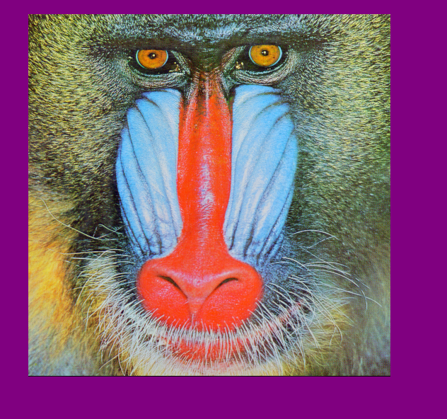

```@meta
DocTestSetup = quote
    using Colors, ImageFiltering, TestImages
    img = testimage("mandrill")
end
```

# ImageFiltering.jl

ImageFiltering supports linear and nonlinear filtering operations on
arrays, with an emphasis on the kinds of operations used in image
processing.

The main functions provided by this package are:

| Function                 | Action         |
|:-------------------------|:---------------|
|[`imfilter`](@ref)        | Filter a one, two or multidimensional array img with a kernel by computing their correlation |
|[`imfilter!`](@ref)       | Filter an array img with kernel kernel by computing their correlation, storing the result in imgfilt |
|[`mapwindow`](@ref)       | Apply a function to sliding windows of img  |
|[`mapwindow!`](@ref)      | A variant of [`mapwindow`](@ref) with preallocated output |
|[`imgradients`](@ref)     | Estimate the gradient of img in the direction of the first and second dimension at all points of the image, using a kernel|
|[`padarray`](@ref)        | Generate a padded image from an array img and a specification border |
|[`kernelfactors`](@ref)   | Prepare a factored kernel for filtering. |
|[`findlocalminima`](@ref) | Returns the coordinates of elements whose value is smaller than all of their immediate neighbors |
|[`findlocalmaxima`](@ref) | Returns the coordinates of elements whose value is larger than all of their immediate neighbors |

Common kernels (filters) are organized in the `Kernel` and `KernelFactors` modules.

A common task in image processing and computer vision is computing
image *gradients* (derivatives), for which there is the dedicated
function [`imgradients`](@ref).

## Examples

The most commonly used function for filtering is [`imfilter`](@ref). Here's a simple example of linear filtering:

```julia
julia> using ImageFiltering, TestImages

julia> img = testimage("mandrill");

julia> imgg = imfilter(img, Kernel.gaussian(3));

julia> imgl = imfilter(img, Kernel.Laplacian());
```

When displayed, these three images look like this:


The `padarray` function can add (or remove) elements from the borders of an
image, using various methods for generating any new pixels required. This
example adds purple pixels on the top, left, bottom, and right edges:

```julia
julia> using ImageFiltering, TestImages

julia> img = testimage("mandrill")

julia> padarray(img, Fill(colorant"purple", (20, 40), (60, 80)))
```



## Feature: arbitrary operations over sliding windows

This package also exports [`mapwindow`](@ref), which allows you to
pass an arbitrary function to operate on the values within a sliding window.

`mapwindow` has optimized implementations for some functions
(currently, `extrema`).

### Feature: automatic choice of FIR or FFT

For linear filtering with a finite-impulse response filtering, one can
either choose a direct algorithm or one based on the fast Fourier
transform (FFT).  By default, this choice is made based on kernel
size. You can manually specify the algorithm using [`Algorithm.FFT()`](@ref)
or [`Algorithm.FIR()`](@ref).

#### Reusing FFT plans

It is possible to reuse FFT plans if the operation is going to be done on the
same array type and dimensions i.e. on each image of an image stack

```julia
using ImageFiltering, ComputationalResources
imgstack = rand(Float64, 200, 100, 10)
imgstack_filtered = similar(imgstack)

kernel = ImageFiltering.factorkernel(Kernel.LoG(1))
fft_planned = CPU1(ImageFiltering.planned_fft(imgstack_filtered[:,:,1], kernel))

for i in axes(imgstack, 3)
    imfilter!(fft_planned, imgstack_filtered[:,:,i], imgstack[:,:,i], kernel)
end
```

### Feature: Multithreading

If you launch Julia with `JULIA_NUM_THREADS=n` (where `n > 1`), then
FIR filtering will by default use multiple threads.  You can control
the algorithm by specifying a *resource* as defined by
[ComputationalResources](https://github.com/timholy/ComputationalResources.jl).
For example, `imfilter(CPU1(Algorithm.FIR()), img, ...)` would force
the computation to be single-threaded.

### Feature: Models

The `ImageFilter.Models` submodule provides predefined image-related models and its solvers that can be reused
by many image processing tasks.

For example, the `solve_ROF_PD()` function uses the primal-dual method to return a smoothed version of an image using Rudin-Osher-Fatemi (ROF) filtering, more commonly known as Total Variation (TV) denoising or TV regularization.
