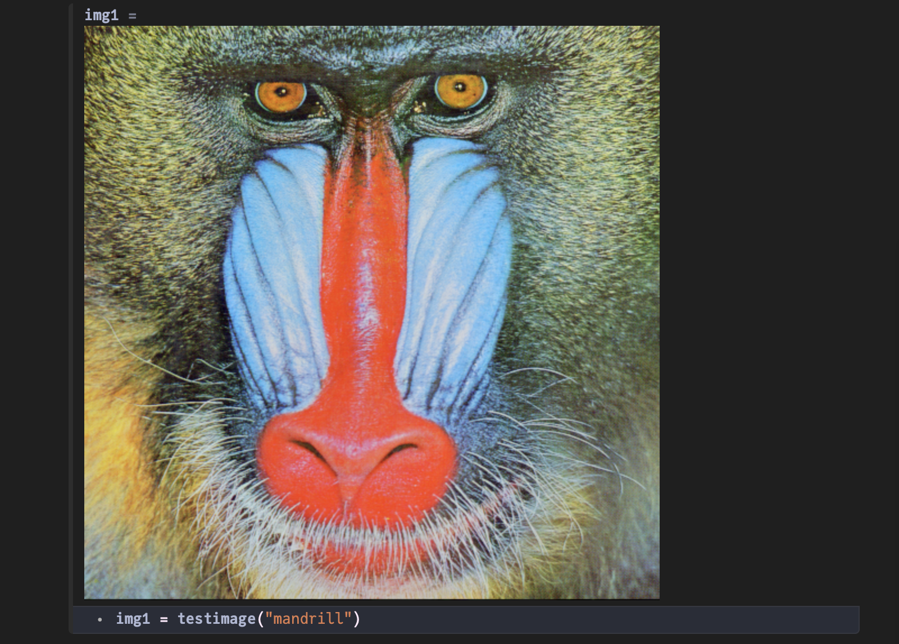

# Tutorial

## About this tutorial

This is a short introduction to ImageFilters.jl, using a [Pluto
notebook](https://plutojl.org). If you're familiar with the basics of using
Pluto, you're ready to follow along.

## First steps

Open a Pluto notebook and load the following packages:

```julia
using ImageFiltering, TestImages, PlutoUI, ImageShow, Colors, Images
```


We'll use the image of the mandrill from TestImages.jl:

```julia
img1 = testimage("mandrill")
```



## Blurring an image

To make a blurred version of the image, we can use a Gaussian filter kernel,
using the `Kernel.gaussian()` function. A value of `10` is quite blurry:

```julia
img2 = imfilter(img1, Kernel.gaussian(10))
```


It's also possible to use an array as a kernel. This 3 × 3 array in `k` is a
good example of a sharpening filter: the central pixel will be boosted.

```julia
k = [0 -1 0 ; -1 5.5 -1 ; 0 -1 0]
```


```julia
img3 = imfilter(img1, k)
```


## Applying a function to each pixel

The `mapwindow()` function provides a way to slide a rectangular "window" over
every pixel, and apply a function to that pixel using the surrounding pixel
values. The window can be `m` pixels across and `n` pixels down; `m` and `n`
must both be odd.

By default every pixel is visited.

This example uses a 13 × 13 window, and randomly selects just one of the 169
pixels in that window as the new value for the pixel.

```julia
mapwindow(b -> b[rand(1:end)], img1, (13, 13))
```

The result is like a dithered/downsampled version of the image.


In the next example, this short function is used to convert the buffer to gray
values, find the lowest (minimum) value of the windowed area, then select the
colored pixel at that point. The resulting image is thus a darker and less
detailed version of the original.

```julia
function minimum_color(buff::T) where T <: Array
	gbuff = Gray.(buff)
	k = argmin(gbuff)
	return buff[k]
end

mapwindow(minimum_color, img1, (5, 5))
```


